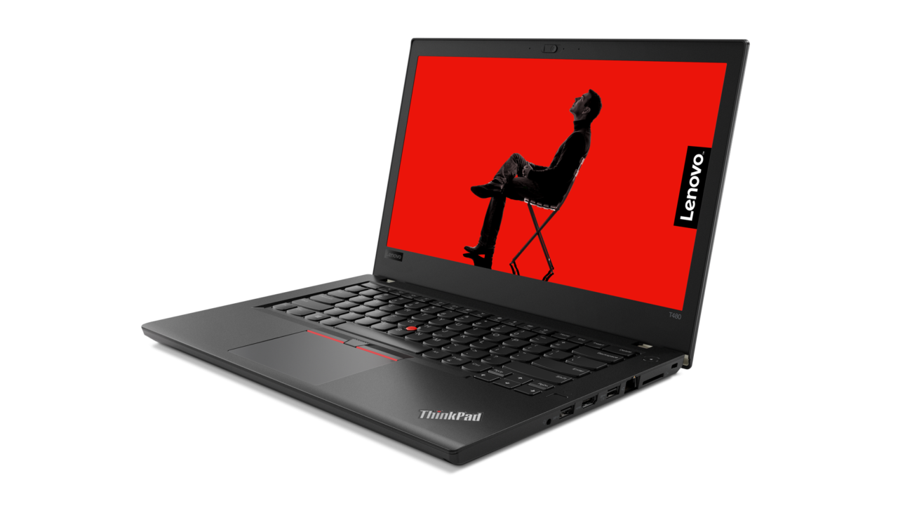
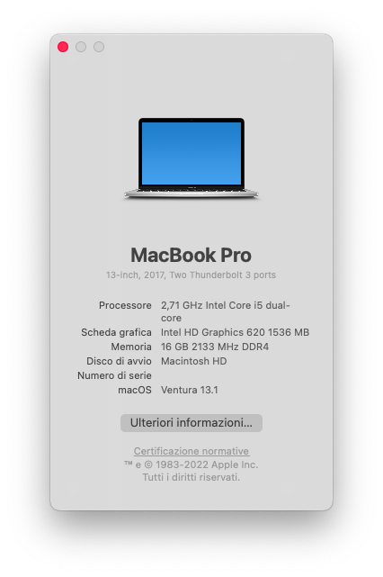
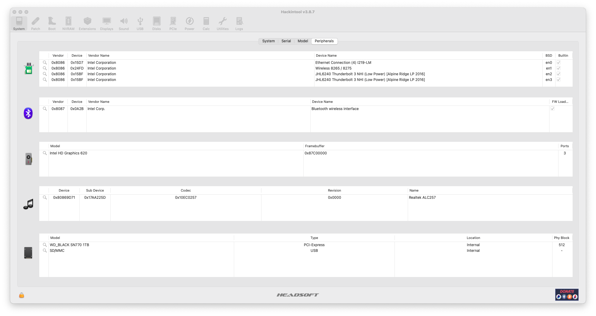
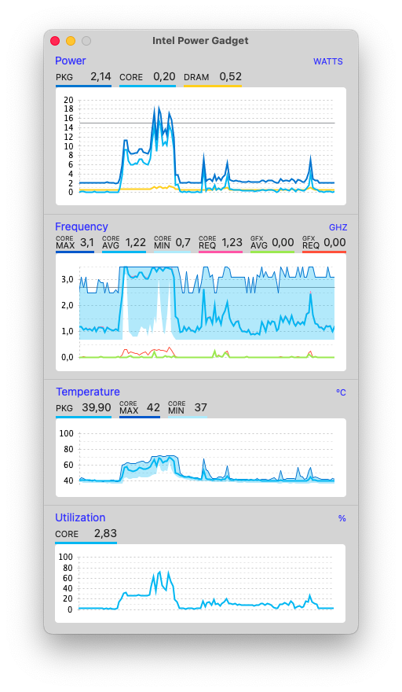

  

# Lenovo ThinkPad T480 - Hackintosh :sunglasses:

Follow me with the stars if you like my EFI ❤️

## EFI for Lenovo ThinkPad T480 with OpenCore 0.8.8 bootloader.

## ‼️ Attention ## 

Please generate SMBIOS and add to conflig.plist (Using https://github.com/corpnewt/GenSMBIOS)

## 💻 Info PC:

| Component        | Brank                                  |
| ---------------- | ---------------------------------------|
| CPU              | Intel® Core™ i5-7300U                  |
| iGPU             | Intel® UHD Graphics 620                |
| Audio            | Realtek ALC256                         |
| RAM              | 16 GB DDR4 2400 Mhz                    |
| WiFi + Bluetooth | INTEL Wi-Fi AC 8265NGW + Bluetooth 4.2 |
| LAN              | Intel Ethernet Connection I219-V       |
| Thunderbolt 3    | JHL6240 Thunderbolt 3 LP Alpine Ridge  |
| NVMe             | WD_BLACK SN770 M.2 2280 NVME (MacOS)   |
| SMBios           | MacBook Pro 14,1                       |
| BootLoader       | OpenCore 0.8.8                         |
| macOS            | Ventura 13.1 (22C65)                   |

## ✅ What works 

- [x] Battery Percentage (The double battery is working properly)
- [x] CPU Power Management / Performance
- [x] Intel Graphics UHD iGPU HDMI Output
- [x] Intel AC 8265NGW Wi-Fi and Bluetooth
- [x] Intel Ethernet Connection I219-V
- [x] iMessage, FaceTime, App Store, iTunes Store
- [x] Sidecar wired (Works with 14,1 SMBIOS)
- [x] Realtek ALC256 Internal Speakers
- [x] Realtek ALC256 HDMI Audio Output
- [x] TouchPad 1-5 fingers swipe (Emulate force touch using longer and more voluminous touch)
- [x] TrackPoint
- [x] Camera (USB connected)
- [x] Sleep / Wake / SpeedStep 
- [x] LED Functionality (blinking after WAKE/SLEEP)
- [x] Thinkpad Assistant (F4 key: Mute/Unmute microphone with LED, F7:dual display, F8:Wi-Fi, F9:preferences, F10:bluetooth, F11:keyboard, F12:launchpad & Fn-Space:keyboard backlight, Fn+ESC: switch function/media keys)
- [x] Yoga SMC Panel (Fan Read / Fan Control)
- [x] NO Color Banding, Display is correctly seen as 24-Bit Color (ARGB8888)
- [x] Thunderbolt 100% Functionality for LP Alpine Ridge
- [x] Thunderbolt Hotplug for LP Alpine Ridge
- [x] USB C Hotplug For LP Alpine Ridge
- [x] All USB Ports (3.0/3.1)
- [x] SDXC Card Reader (USB connected)
- [x] Dual Boot Windows 11 / MacOS
- **NEW FEATURES**
- [x] Apple Music Lossless (Hi-Res Audio)

## 🪛 BIOS Settings

-  `Security > Security Chip`: **Disabled**
-  `Memory Protection > Execution Prevention`: **Enabled**
-  `Virtualization > Intel Virtualization Technology`: **Enabled**
-  `Virtualization > Intel VT-d Feature`: **Enabled**
-  `Anti-Theft > Computrace -> Current Setting`: **Disabled**
-  `Secure Boot > Secure Boot`: **Disabled**
-  `Intel SGX -> Intel SGX Control`: **Disabled**
-  `Device Guard`: **Disabled**

In StartUp Menu, set the following options:

-  `UEFI/Legacy Boot`: **UEFI Only**
-  `CSM Support`: **No**

In Thunderbolt Menu, set the following options:

-  `Thunderbolt BIOS Assist Mode`: **Disabled**
-  `Wake by Thunderbolt(TM) 3`: **No**
-  `Security Level`: **No**
-  `Support in Pre Boot Environment > Thunderbolt(TM) device`: **Enabled**

## Peripherals & Other

## What doesn't or WIP:

CFG Unlock / DVMT Unlock / AirDrop

## Credits

- [Apple](https://apple.com) for macOS.
- [Acidanthera](https://github.com/acidanthera) for OpenCore and all the lovely hackintosh work.
- [Dortania](https://dortania.github.io/OpenCore-Install-Guide/config-laptop.plist/icelake.html) For great and detailed guides.
- [Baio1977](https://github.com/Baio1977/)
- [Dreamwhite](https://github.com/dreamwhite)

## 📜 License

This repo is licensed under the [MIT License](https://github.com/pierpaolodimarzo/ThinkPad-T480/blob/main/LICENSE).

OpenCore is licensed under the [BSD 3-Clause License](https://github.com/acidanthera/OpenCorePkg/blob/master/LICENSE.txt).
